# CAPIBARES 17 🦫🦫🦫 (los mas gossu)

## Integrantes del grupo

| N°  | Nombre del integrante | Parte desarrollada                                    |
| --- | --------------------- | ----------------------------------------------------- |
| 1   | Yojhan Huanca         | Consumo de API TMDB e interfaz de peliculas populares |
| 2   | Anderson rivera       | lo mismo que el de arriba y que el de abajo           |
| 3   | NCarlos carbajal      | consumo de apis y renderizado                         |

---

# Reporte Individual - CineSpoilerS

## Integrante

**Nombre:** Yojhan Huanca  
**Proyecto:** CineSpoilerS  
**Parte desarrollada:** Consumo de API TMDB e interfaz de peliculas populares

## Descripcion de mi trabajo

En esta parte del proyecto desarrolle la conexion con la API de TMDB para obtener peliculas populares y mostrarlas en una interfaz web creada con React, TypeScript, Vite, Tailwind CSS y componentes estilo shadcn/ui.

## Tecnologias usadas

- React
- TypeScript
- Vite
- Tailwind CSS
- shadcn/ui
- Axios
- Lucide React
- TMDB API

## Actividades realizadas

## 1. Creacion del proyecto

Se creo el proyecto base usando React, TypeScript y Vite.


## 2. Limpieza inicial

Se eliminaron archivos innecesarios del template inicial para trabajar con una estructura mas limpia.


## 3. Configuracion de Tailwind CSS

Se configuro Tailwind CSS para manejar los estilos de la aplicacion.


## 4. Configuracion del alias @

Se configuro el alias @ para importar archivos desde la carpeta src de forma mas ordenada.


## 5. Configuracion de shadcn/ui

Se agrego y probo el componente Button como parte de la configuracion de componentes reutilizables.


## 6. Conexion con TMDB

Se instalo Axios y se configuraron las variables de entorno para consumir la API de TMDB.

Variables usadas:

    VITE_TMDB_BASE_URL=https://api.themoviedb.org/3
    VITE_TMDB_API_TOKEN=token_de_tmdb

Se valido en consola que la API devolviera correctamente el arreglo de peliculas populares.


## 7. Interfaz final

Se creo una interfaz visual para mostrar las peliculas populares en tarjetas responsive.


## Archivos principales trabajados

    src/
      App.tsx
      services/
        tmdb.ts
      lib/
        axios.ts
        utils.ts
      components/
        ui/
          button.tsx
          card.tsx
          badge.tsx

## Funcionalidades implementadas

- Consumo de peliculas populares desde TMDB.
- Configuracion de Axios.
- Uso de variables de entorno.
- Renderizado de peliculas en tarjetas.
- Diseño responsive.
- Estado de carga.
- Estado de error.
- Boton para actualizar la informacion.
- Interfaz oscura con estilo cinematografico.

## Repositorio de mi parte

https://github.com/yojhanHuanca/CinnSin

## Integrante

**Nombre:** Anderson Rivera
**Proyecto:** CineSpoilerS  
**Parte desarrollada:** Consumo de API TMDB e interfaz de peliculas populares

# Descripcion

CineSpoilerS es una app web de películas que consume la API de The Movie Database (TMDB) para mostrar información actualizada de estrenos, detalles y tendencias.

## Tecnologías usadas

- React
- Tailwind CSS
- shadcn/ui
- Axios
- TMDB API

## Instalación

```bash
cd cinespoilers3
npm install
npm run dev
```

## Estructura del proyecto

- `src/`
  - `components/` - componentes UI reutilizables
  - `pages/` - pantallas principales
  - `services/` - llamadas a API y lógica de datos
  - `types/` - tipos TypeScript
  - `lib/` - utilidades compartidas
- `public/` - activos estáticos
- `.env` - variables de entorno, clave TMDB
- `vite.config.ts` - configuración de Vite

## Capturas

A continuación se presentan las capturas en orden, con títulos claros y profesionales:

1. **Servidor corriendo**
   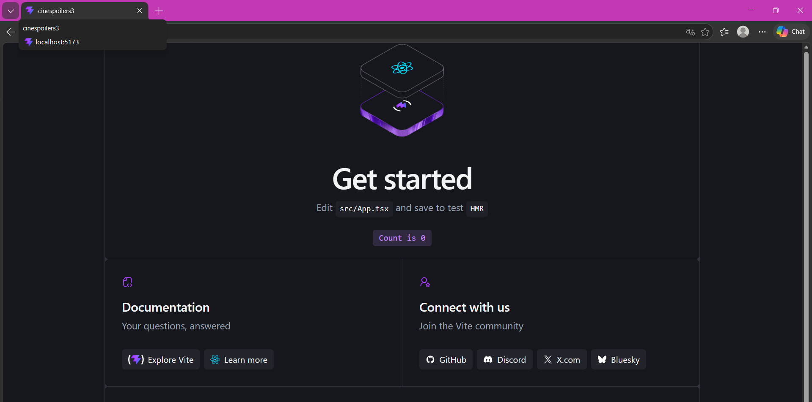

2. **Limpieza del proyecto**
   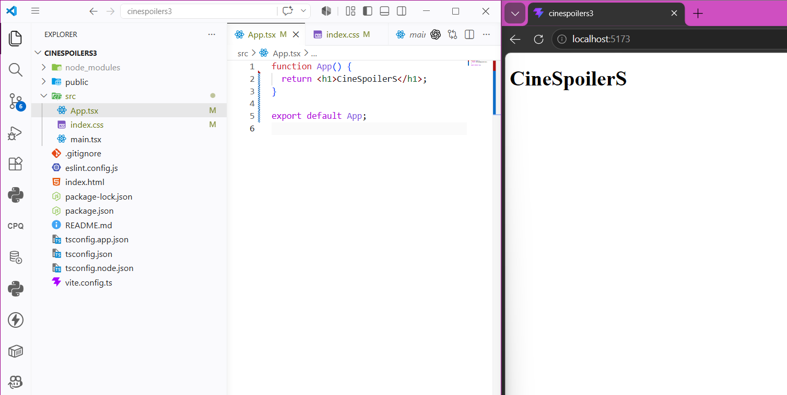

3. **Instalar Tailwind**
   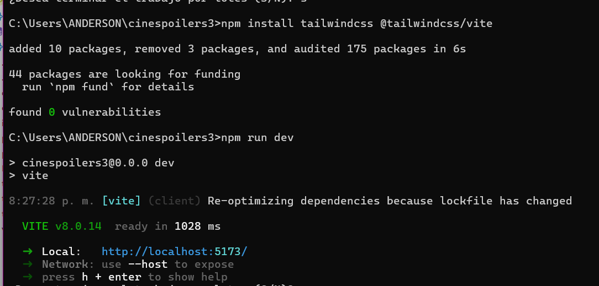

4. **Instalar y probar shadcn/ui**
   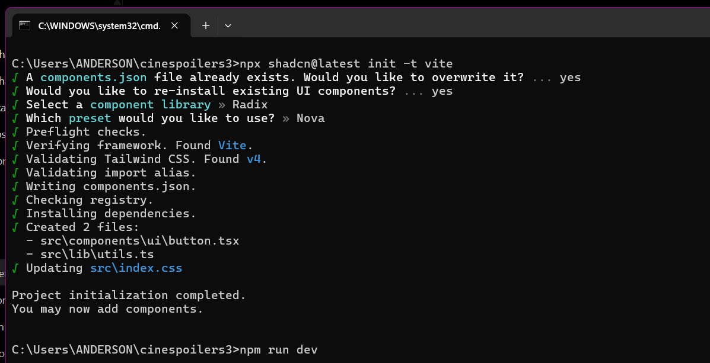
   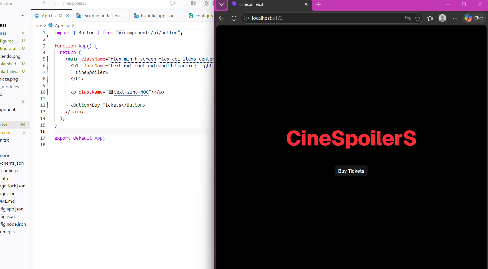
5. **Configurar alias**
   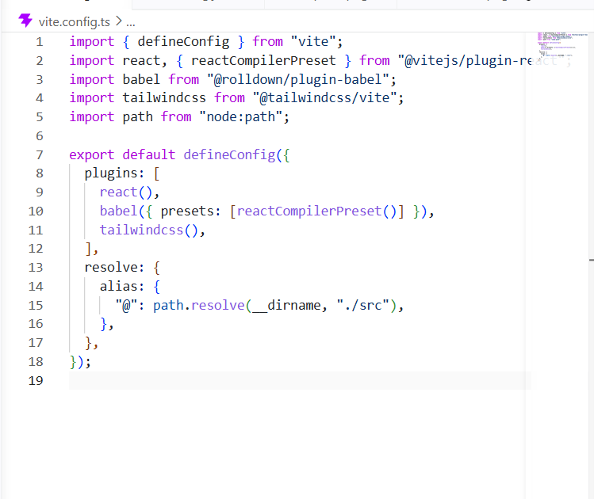

   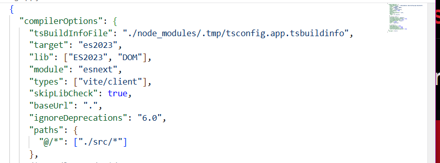

6. **Instalar y configurar axios**
   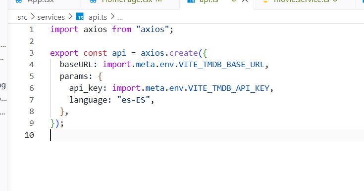
   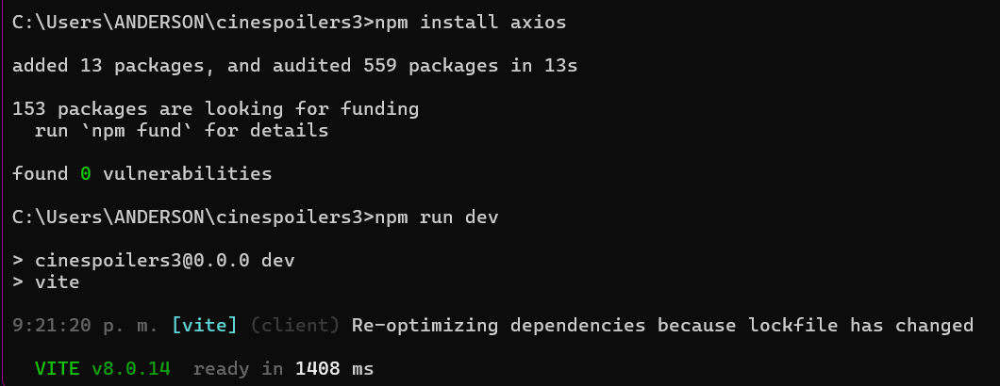
7. **Mostrar datos en consola**
   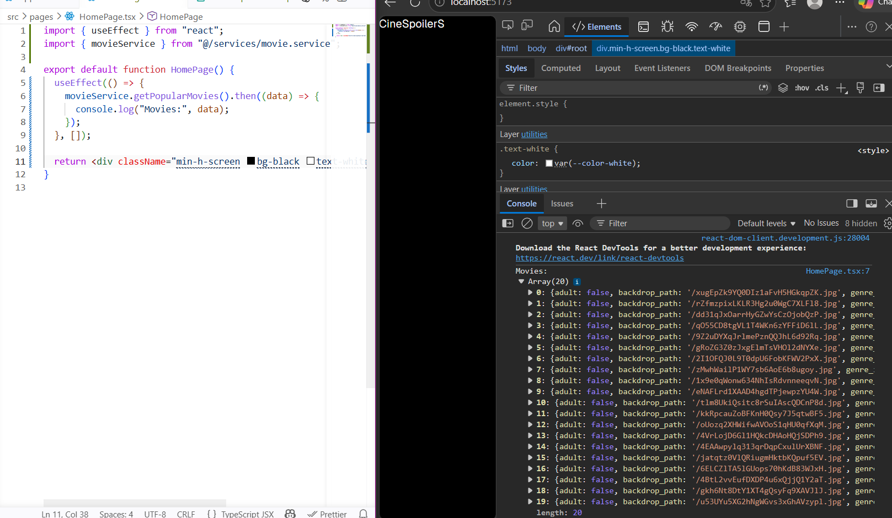
8. **Captura general**
   

## Configuración de API

1. Crea un archivo `.env` en la raíz del proyecto.
2. Añade la clave de TMDB:

```env
VITE_TMDB_API_KEY=tu_clave_tmdb_aqui
```

3. Reinicia el servidor de desarrollo si está en ejecución.

## Integrante

**Nombre:** Carlos Carbajal
**Proyecto:** CineSpoilerS  
**Parte desarrollada:** Consumo de API TMDB e interfaz de peliculas populares

# Descripcion

> E-commerce de tickets de cine construido con React 19 + TypeScript + Vite. Base escalable para un proyecto real de venta de entradas.
> Proyecto educativo — Lab 11 · 2026

## 🛠️ Tech Stack

| Tecnología            | Uso                               |
| --------------------- | --------------------------------- |
| React 19 + TypeScript | UI y tipado                       |
| Vite                  | Bundler y dev server              |
| Tailwind CSS v4       | Estilos utilitarios               |
| shadcn/ui             | Componentes UI                    |
| Axios                 | HTTP client                       |
| React Router v6       | Navegación                        |
| Zustand               | Estado global (carrito)           |
| TMDB API              | Datos de películas en tiempo real |

---

## 🚀 Instalación

```bash
# Clonar el repositorio
git clone https://github.com/cinespoilers/cinespoilers.git
cd cinespoilers

# Instalar dependencias
npm install

# Iniciar servidor de desarrollo
npm run dev
```

## 📸 Evidencias

### 1. Proyecto creado

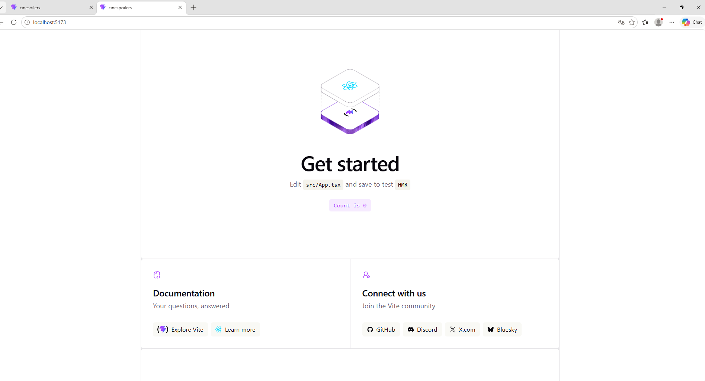

### 2. Inicio limpio

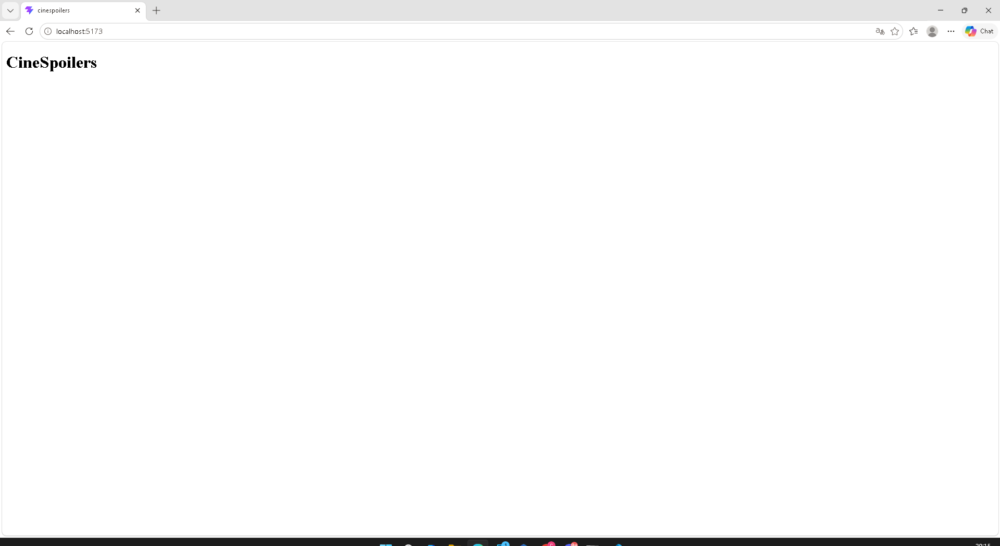

### 3. Instalar Tailwind CSS

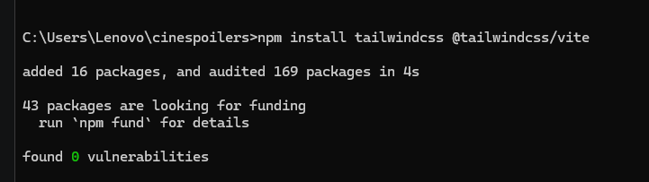

### 4. Configurar alias

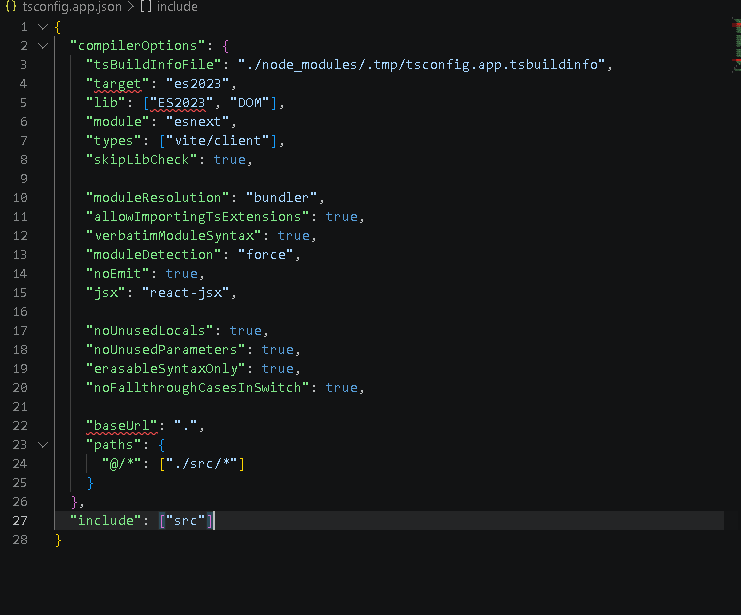

### 5. Instalar shadcn

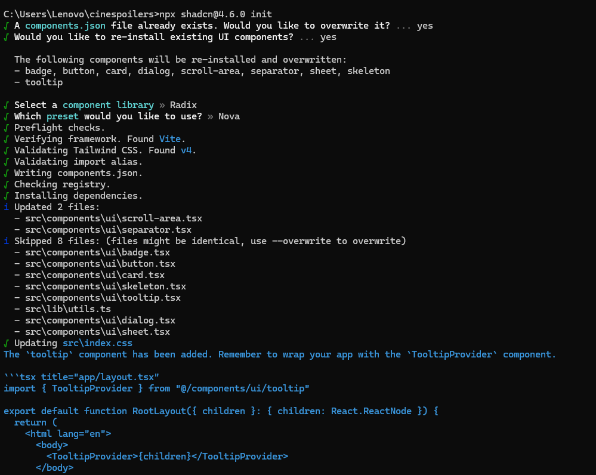

### 6. Botón shadcn

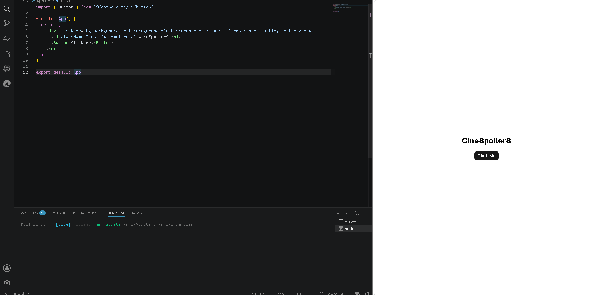

### 7. Configurar shadcn


### 8. Instalar y configurar Axios


### 9. Fetching de datos


### 10. Mostrar por consola


### 11. Renderizado

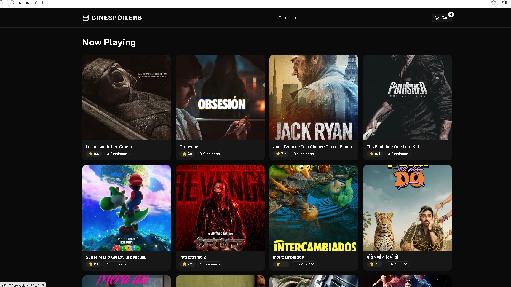
